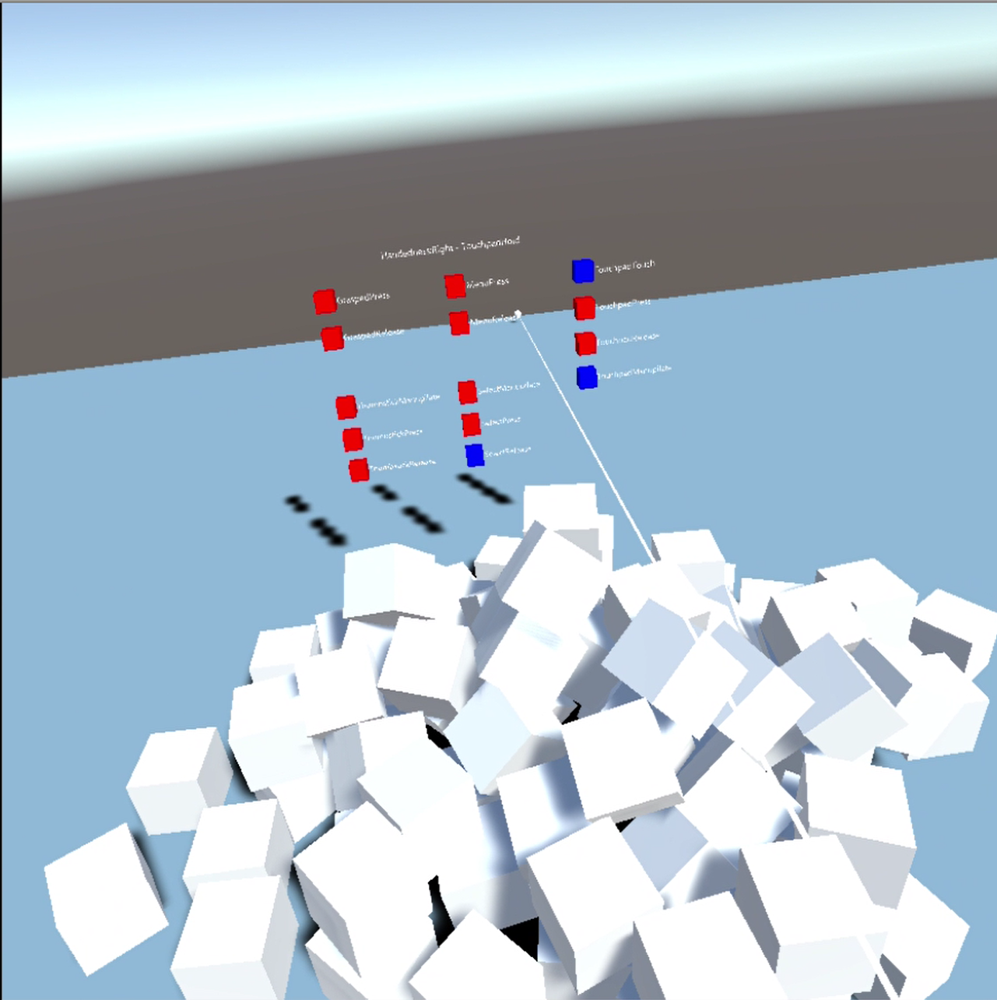

# MotionControllerManager-
WinMRでモーションコントローラの操作に対してイベント制御を可能にする部品です。
## 環境
以下の環境で作成しています。

* Unity 2017.2.0f3
* [MixedRealityToolkit-Unity 2017.2.1.0](https://github.com/Microsoft/MixedRealityToolkit-Unity/releases/tag/2017.2.1.0)

## 主な機能
#### MotionControllerの各ボタンに対して押す/離す/保持の状態でイベントを管理することができるMotionContollerManagerクラスを提供します。

|イベント名|説明|
|:-:|:--|
|Grasped|Occurs when grasp button of motion controller is pressed.|
|Released|Occurs when grasp button of motion controller is released.|
|MenuDown|Occurs when a menu button of motion controller is pressed.|
|MenuUp|Occurs when a menu button of motion controller is released.|
|MotionControllerManipulate|Occurs when motion controller is manipulated.|
|SelectDown|Occurs when select button of motion controller is pressed.|
|SelectHold|Occurs when select button of motion controller is held.|
|SelectUp|Occurs when select button of motion controller is released.|
|ThumbstickDown|Occurs when thumbstick button of motion controller is pressed.|
|ThumbstickHold|Occurs when thumbstick button of motion controller is held.|
|ThumbstickUp|Occurs when thumbstick button of motion controller is released.|
|TouchpadTouch|Occurs when touchpad button of motion controller is touched.|
|TouchpadDown|Occurs when touchpad button of motion controller is pressed.|
|TouchpadHold|Occurs when touchpad button of motion controller is held.|
|TouchpadUp|Occurs when touchpad button of motion controller is released.|

#### 各ボタンの押下時にモーションコントローラのポインターに向けてマーカーを出力します。


## 実装方法
1. MotionControllerManager.prefabをHierarchyにセットします。
2. 任意のスクリプト内でMotionControllerManagerに対してイベントを定義します。
```
void Start () 
{
    MotionControllerManager.Instance.TouchpadTouch += TouchpadTouch;
    MotionControllerManager.Instance.Grasped += GraspedPress;
    MotionControllerManager.Instance.Released+= GraspedRelease;
    MotionControllerManager.Instance.MenuDown+= MenuPress;
    MotionControllerManager.Instance.MenuUp+= MenuRelease;
    MotionControllerManager.Instance.SelectHold+= SelectManupilate;
    MotionControllerManager.Instance.SelectDown+= SelectPress;
    MotionControllerManager.Instance.SelectUp+= SelectRelease;
    MotionControllerManager.Instance.ThumbstickHold+= ThumbstickManupilate;
    MotionControllerManager.Instance.ThumbstickDown+= ThumbstickPress;
    MotionControllerManager.Instance.ThumbstickUp+= ThumbstickRelease;
    MotionControllerManager.Instance.TouchpadHold+= TouchpadManupilate;
    MotionControllerManager.Instance.TouchpadUp+= TouchpadRelease;
    MotionControllerManager.Instance.TouchpadDown+= TouchpadPress;
}
```
3. マーカー出力の有無はMotionControllerManagerのInspector内で変更します。
